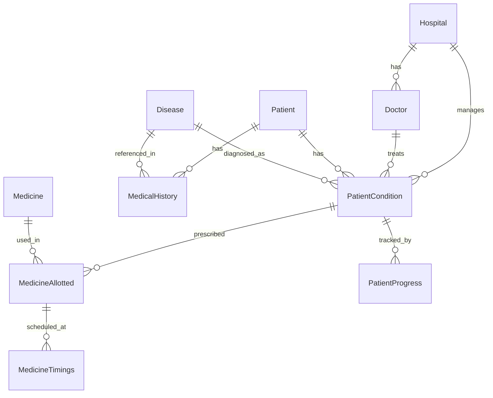

# Database Seeding

Populates the database with realistic sample data for development and testing.

## Quick Start

```bash
bun run db:seed
```

## Seeded Data

| Model | Count | Notes |
|---|---|---|
| Disease | 6 | 4 Chronic, 2 Acute |
| Medicine | 7 | Tablets, Inhaler, Capsule, Syrup |
| Hospital | 3 | Apollo Delhi, AIIMS, Fortis Gurgaon |
| Doctor | 4 | 2 at Apollo, 1 at AIIMS, 1 at Fortis |
| Patient | 4 | Mixed genders, blood groups |
| MedicalHistory | 5 | Linked to patients & diseases |
| PatientCondition | 4 | STABLE, CRITICAL, RECOVERED statuses |
| MedicineAllotted | 4 | Medicines assigned to conditions |
| MedicineTimings | 8 | Morning / afternoon / night schedules |
| PatientProgress | 6 | Follow-up records with recovery % |

## Login Credentials

All hospitals share the same password for dev convenience:

| Hospital | User ID | Password |
|---|---|---|
| Apollo Hospital Delhi | `apollo_delhi` | `Hospital@123` |
| AIIMS New Delhi | `aiims_delhi` | `Hospital@123` |
| Fortis Gurgaon | `fortis_gurgaon` | `Hospital@123` |

## Idempotency

- **Safe to re-run** for base entities (Disease, Medicine, Hospital, Doctor, Patient) — they use `upsert` on unique fields.
- **Will duplicate** relational records (Conditions, Allotments, Timings, Progress) on repeated runs — these use `create` / `createMany`.

> [!TIP]
> If you need a clean slate, run `prisma migrate reset` — it drops and recreates the DB, then auto-runs the seed.

## Entity Relationships



## Sample Patients

| Name | Mobile | Blood Group | Gender |
|---|---|---|---|
| Amit Kumar | 9876543210 | B+ | Male |
| Sunita Devi | 9876543211 | O+ | Female |
| Rahul Verma | 9876543212 | A- | Male |
| Meera Joshi | 9876543213 | AB+ | Female |

## Diseases

| Name | Type |
|---|---|
| Diabetes Mellitus Type 2 | Chronic |
| Hypertension | Chronic |
| Asthma | Chronic |
| Pneumonia | Acute |
| Dengue Fever | Acute |
| Migraine | Chronic |

## Medicines

| Brand | Generic Name | Form | Strength | Manufacturer |
|---|---|---|---|---|
| Glucophage | Metformin | Tablet | 500mg | Merck |
| Amlodac | Amlodipine | Tablet | 5mg | Zydus |
| Asthalin | Salbutamol | Inhaler | 100mcg | Cipla |
| Augmentin | Amoxicillin/Clavulanate | Tablet | 625mg | GSK |
| Crocin | Paracetamol | Tablet | 500mg | GSK |
| Pan-D | Pantoprazole/Domperidone | Capsule | 40mg | Alkem |
| Benadryl | Diphenhydramine | Syrup | 100ml | J&J |
